# PhotoSelectSdk
Android端相册和相机集成SDK，可用于头像功能

提供三个接口调用：
（1）弹窗调用
（2）相册接口调用
（3）相机接口调用

### 使用-导入Lib
#### 由于是提供给Unity在游戏中调用，实现头像选取功能，故demo是采用了eclipse的导入方式，可将photosdk_lib作为Module导入到项目中，并添加依赖，如下：
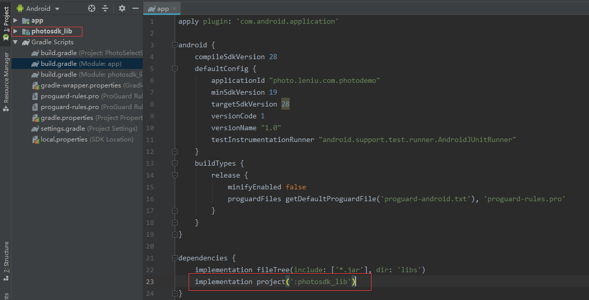

### demo运行截图
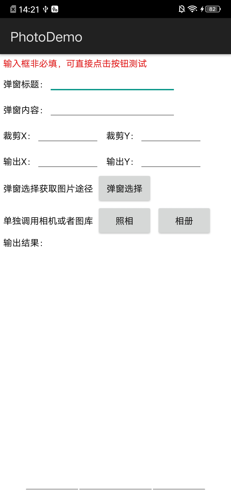

#### 弹窗调用
#### 可自定义传入弹窗title，content，显示自定义的标题和内容
#### demo调用代码
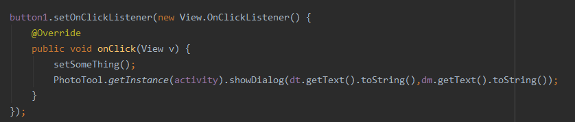

#### 运行截图
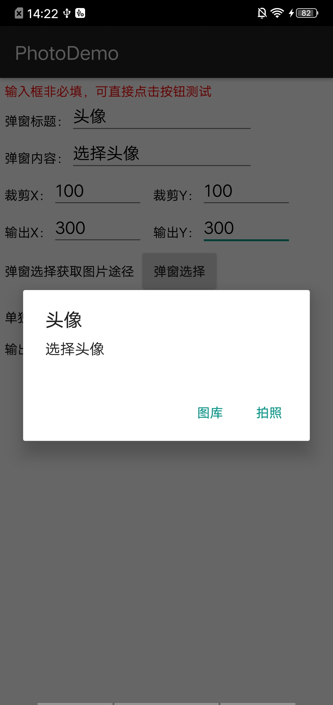

### 相册接口调用
#### 单独调用相册接口，获取并返回处理后的图片
#### demo调用代码
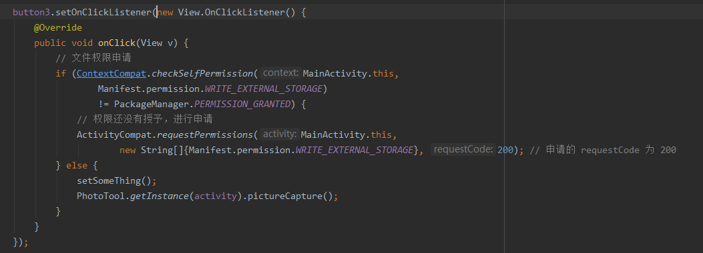

#### 运行截图
<table><tr>
  <td>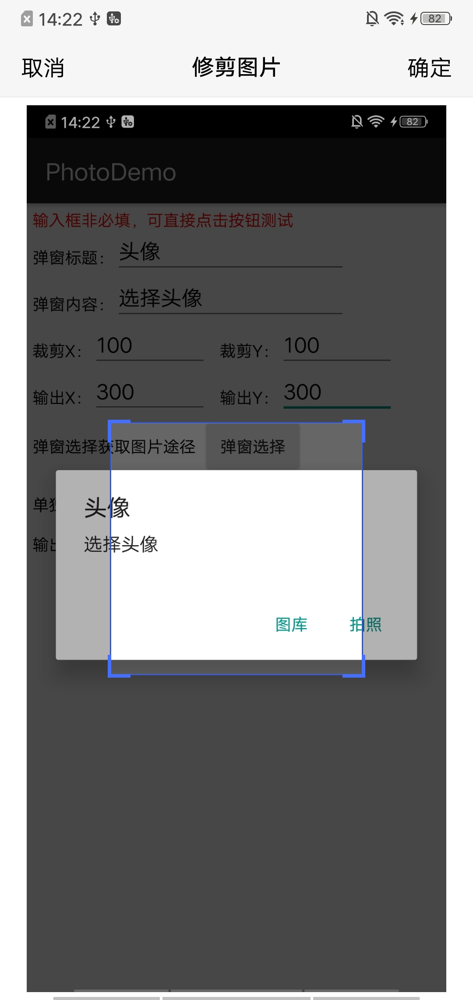</td>
  <td>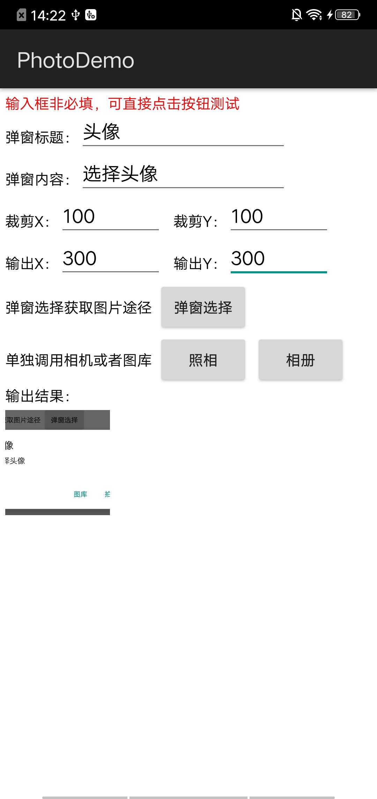</td>
</tr></table>

### 相机接口调用
#### 单独调用相册接口，获取并返回处理后的图片
#### demo调用代码
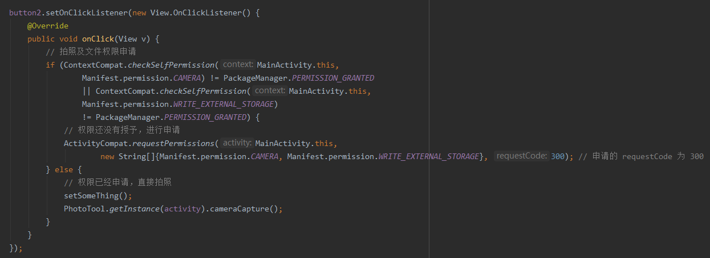

#### 运行截图
<table><tr>
  <td>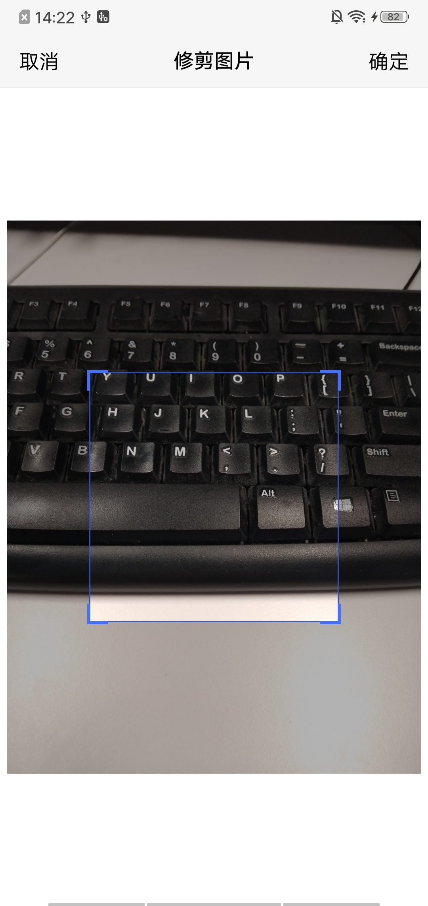</td>
  <td>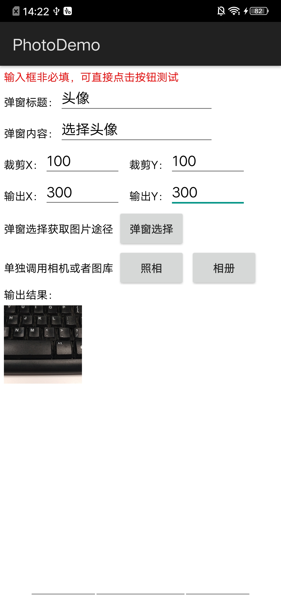</td>
</tr></table>

### 按需重写onActivityResult
#### demo代码块
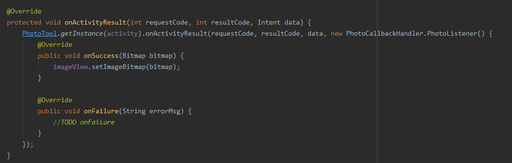

### 动态权限
#### 如有实现动态权限，可省略示例代码中关于权限的判断及调用
#### demo代码块
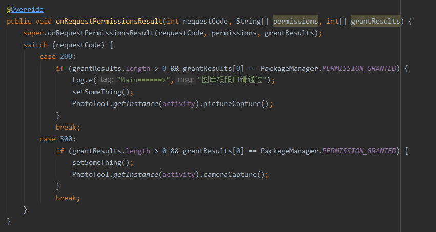

## 2019-8-2 更新：
#### 处理问题bug，因模拟器存在无相机的情况导致闪退发生，故相机接口调用增加模拟器判读
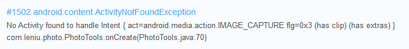

#### 通过光感器判断模拟器，true为模拟器，false为真机
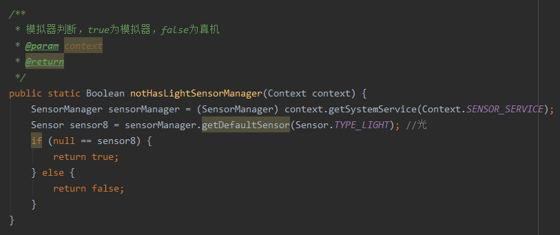

#### 测试截图，模拟器toast提示，真机正常调用
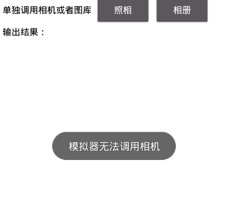
